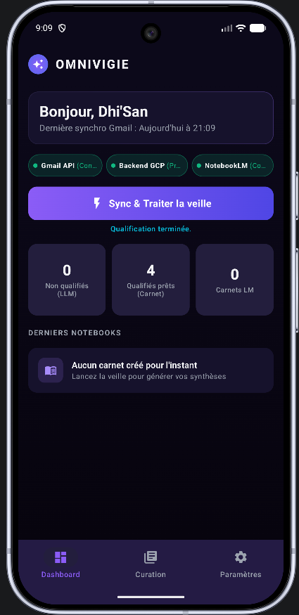
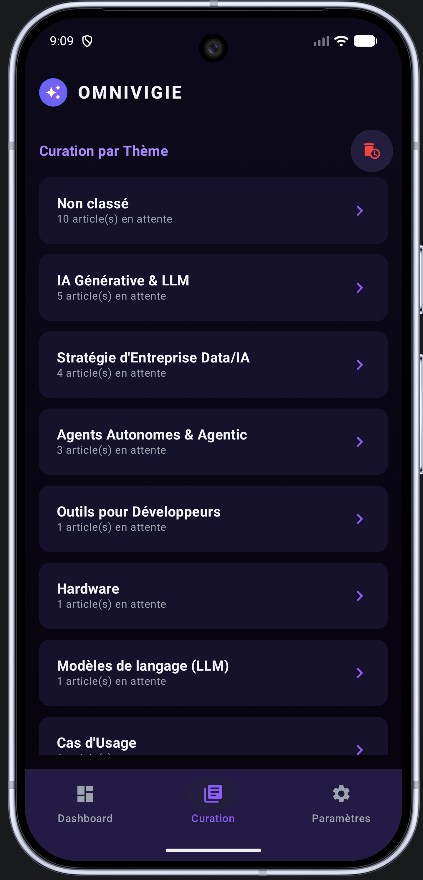
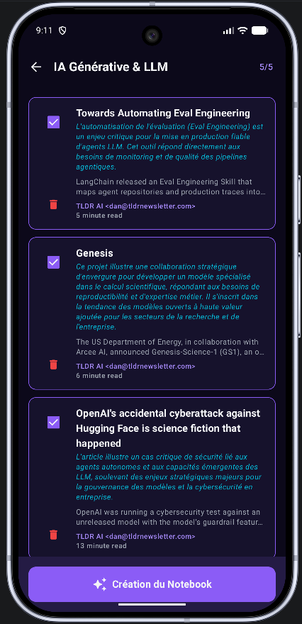
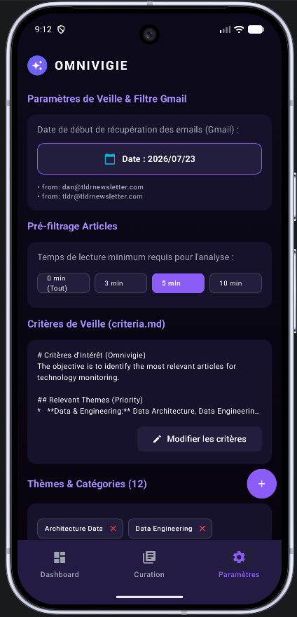

# Omnivigie Android - L'Assistant de Veille Technologique Automatisé

**Omnivigie Android** est une application native Android (Kotlin / Jetpack Compose) de veille technologique automatisée. Elle transforme la lecture passive de newsletters IT en une chaîne d'analyse intelligente alimentée par **Google Gemini 2.0** et **Google NotebookLM**.

---

## 🎯 Fonctionnement Global de l'Application

Omnivigie orchestre l'ensemble du pipeline de veille technologique en 5 grandes étapes :

1. **Acquisition Automatique Gmail** :
   - Connexion sécurisée à votre compte Gmail via l'API Google OAuth2.
   - Récupération ciblée des newsletters de veille (ex: *TLDR AI*, *TLDR Tech*) à partir d'un filtre de date configurable via un **Calendrier interactif** (`after:YYYY/MM/DD`).

2. **Extraction & Nettoyage des Articles** :
   - Parsing HTML haute précision (Jsoup) pour isoler les articles individuels.
   - Nettoyage automatique des URLs (suppression des paramètres de tracking UTM), identification des sponsors et calcul de la durée estimée de lecture.

3. **Qualification par IA (Google Gemini 2.0)** :
   - Analyse automatique de chaque article via l'API **Gemini 2.0 Flash Lite**.
   - Pré-filtrage intelligent : rejet des articles trop courts (seuil configurable), des publicités et des thèmes hors cible (Web3, hardware grand public, finance).
   - Attribution de thèmes de qualification pertinents (*IA Générative*, *Data Engineering*, *Agents Autonomes*, *Outils Développeurs*...).

4. **Curation Visuelle & Sélection** :
   - Organisation des articles par thématiques au sein d'un écran de curation interactif.
   - Filtrage rapide par thèmes, sélection d'articles cibles et suppression rapide d'éléments obsolètes.

5. **Génération de Podcasts & Carnets NotebookLM** :
   - Création automatique d'un carnet **Google NotebookLM** nommé d'après la thématique choisie.
   - Injection en lot des sources (URLs des articles qualifiés).
   - Déclenchement automatisé du **Podcast Audio "Deep Dive"** de NotebookLM pour écouter un résumé synthétique de votre veille.

---

## 📱 Aperçus de l'Interface Utilisateur

| Dashboard Omnivigie | Écran de Curation |
| :---: | :---: |
|  |  |
| **Bilan global, diagnostics et accès direct aux carnets** | **Vue regroupée des articles qualifiés par thématiques** |

| Focus sur un Thème | Paramètres de Veille |
| :---: | :---: |
|  |  |
| **Détail d'un thème avec sélection/suppression des fiches** | **Configuration dynamique des critères, filtres et thèmes** |

---

## 🏗️ Aspects Techniques Structurants

### 1. Architecture MVVM & Clean Architecture
L'application s'appuie sur une architecture Android moderne et réactive :
- **UI Layer** : 100% Jetpack Compose avec le thème "Cosmic Dark", réagissant aux états exposés par `StateFlow`.
- **Domain Layer** : Use Cases métier spécialisés (`QualifyArticlesUseCase`, `CreateThemedNotebookUseCase`).
- **Data Layer** : Base de données locale **Room DB** avec requêtes réactives en `Flow` et dépôts de données encapsulés (`GmailRepository`, `GeminiRepository`, `NotebookLmRepository`).

### 2. Architecture Hybride Android / Backend GCP Cloud Function
Pour contourner la complexité et les instabilités d'automatisation de NotebookLM sur terminal mobile :
- **App Mobile Android** : Gère l'authentification utilisateur, l'interface graphique, la persistance locale et la qualification des contenus via Gemini.
- **Backend GCP (Cloud Function Python)** : Reçoit les demandes de création de notebooks de l'application mobile via des jetons sécurisés **IAM GCP (ID Token)** et s'interface de manière robuste avec l'API interne de NotebookLM en s'appuyant sur la librairie `notebooklm-py`.

### 3. Authentification Multi-Niveaux & WebView Sécurisée
- **Gmail OAuth2 & Credential Manager** : Authentification fluide pour la récupération des newsletters.
- **GCP IAM Authentication** : Obtention d'un jeton d'identité IAM pour sécuriser l'accès à la Cloud Function GCP.
- **Authentification WebView NotebookLM** :
  - Authentification dédiée via une WebView intégrée avec contournement de la restriction Google *"Navigateur non sécurisé"* (utilisation d'un User-Agent Chrome mobile propre et de `androidx.webkit`).
  - Capture et stockage chiffré (`EncryptedSharedPreferences`) du format d'état de session **Playwright (`storage_state.json`)** pour garantir la persistance des sessions entre le téléphone et le backend Cloud Function.

### 4. Paramétrage Dynamique & Persistance Locale Room
L'ensemble des critères de la veille est entièrement dynamique et modifiable depuis l'application :
- **Critères d'Intérêt (`qualification_criteria`)** : Édition libre via une boîte de dialogue dans les paramètres (fallback sur `criteria.md`).
- **Thèmes & Catégories (`qualification_themes`)** : Ajout et suppression dynamique sous forme de chips interactifs (fallback sur `themes.json`).
- **Date de Filtre Gmail (`gmail_filter_date`)** : Sélection graphique par calendrier Material3 DatePicker.
- **Seuil de Temps de Lecture (`min_reading_time`)** : Pré-filtrage configurable (0, 3, 5, 10 min).

---

## 🚀 Stack Technique

- **Langage & Framework** : Kotlin, Jetpack Compose, Coroutines, Flow, StateFlow.
- **Android SDK** : Compile SDK 37 (Android 15), Target SDK 35, Min SDK 26.
- **Base de Données Locale** : Room Database, EncryptedSharedPreferences.
- **IA & APIs** : Google AI SDK (Gemini 2.0 Flash Lite), Retrofit 2, OkHttp 4, Jsoup.
- **Backend Cloud** : Google Cloud Function Python, IAM Authentication.
- **Outils de Build** : Gradle 9.4, AGP 9.2, KSP.
