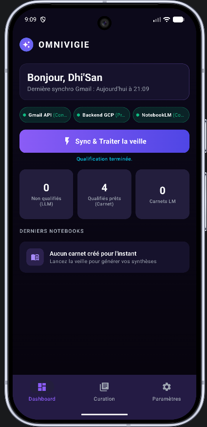
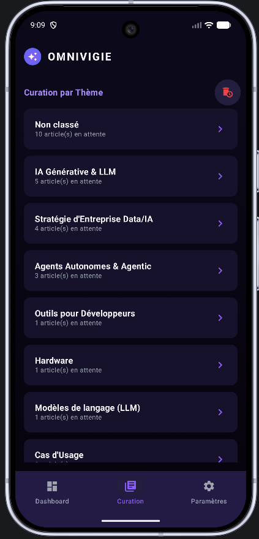
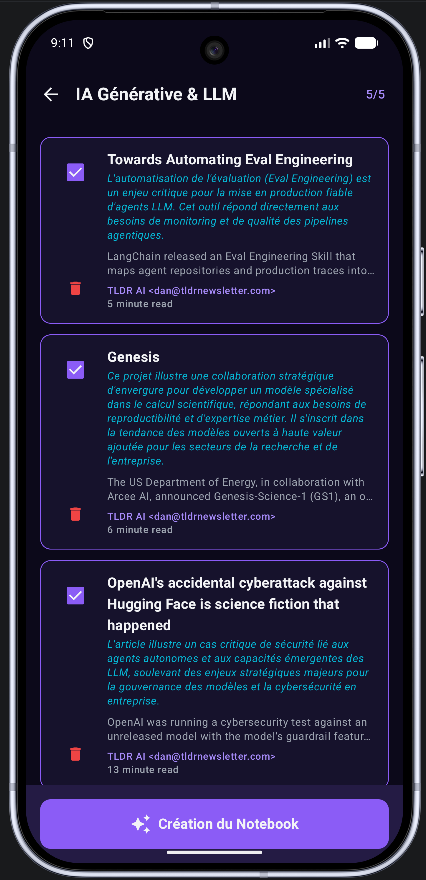
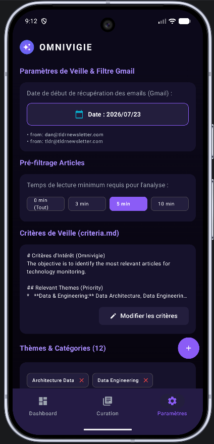

# Omnivigie Android - L'Assistant de Veille Technologique Automatisé

**Omnivigie Android** est une application native Android (Kotlin / Jetpack Compose) de veille technologique automatisée. Elle transforme la lecture passive de newsletters IT (ex: *TLDR AI*, *TLDR Tech*) reçues sur Gmail en une chaîne d'analyse intelligente alimentée par **Google Gemini 2.0 Flash Lite** et **Google NotebookLM**.

---

## 🎯 Pipeline Fonctionnel Détaillé

Omnivigie orchestre l'ensemble du pipeline de veille technologique en 5 grandes étapes :

1. **Acquisition Gmail (Filtre par Date)** :
   - Connexion sécurisée à votre compte Gmail via l'API Google OAuth2 (Credential Manager).
   - Récupération ciblée des newsletters via une requête dynamique `from:dan@tldrnewsletter.com OR from:tldr@tldrnewsletter.com after:YYYY/MM/DD`.
   - La date de début est sélectionnable visuellement via un **Calendrier interactif (Material3 DatePicker)** dans les Paramètres.

2. **Parsing HTML & Extraction des Articles (Jsoup)** :
   - Parsing HTML haute précision pour isoler chaque article (titre, URL, résumé, temps de lecture, détection des sponsors).
   - Nettoyage automatique des URLs (suppression des paramètres de tracking UTM).

3. **Qualification par IA (Google Gemini 2.0 Flash Lite)** :
   - **Niveau 1 (Pré-filtrage)** : Les articles ayant un temps de lecture inférieur au seuil (`minReadingTime`), marqués "N/A" ou sponsors sont immédiatement qualifiés avec `aiInterest = false` et basculés dans la catégorie **"Exclus"**.
   - **Niveau 2 (Qualification LLM)** : Évaluation de chaque article par rapport aux consignes (`qualification_criteria` / `criteria.md`) et thèmes autorisés (`qualification_themes` / `themes.json`). Les articles rejetés par le LLM ou sans thème correspondant sont basculés dans **"Exclus"**.
   - **Gestion des Quotas API LLM (`QuotaExceededException` / Error 429)** : Si le quota d'appel API Gemini est dépassé, l'erreur est interceptée, la qualification est **interrompue immédiatement** et un message d'alerte *"Qualification interrompue (quota API LLM atteint)"* s'affiche sur le Dashboard. Les articles non encore analysés restent en **"Non classé"** pour être repris lors du prochain traitement.

4. **Curation & Gestion des Catégories** :
   - **"Non classé"** (en haut de liste) : Articles fraîchement récupérés en attente de qualification.
   - **Thèmes qualifiés** (*IA Générative & LLM*, *Data Engineering*, *Agents Autonomes*...) : Articles approuvés (`aiInterest = true`).
   - **"Exclus"** (en bas de liste) : Articles rejetés par le Niveau 1 ou le Niveau 2.
   - **Purge ciblée (Poubelle Rouge)** : Un clic sur la poubelle rouge en haut à droite de l'écran Curation supprime **exclusivement** tous les articles de la catégorie **"Exclus"** (avec confirmation). Les articles en "Non classé" restent intacts.

5. **Génération de NotebookLM & Podcast Audio** :
   - Sélection d'articles par thème ➔ Clic sur "Création du Notebook".
   - Appel sécurisé du backend GCP (Cloud Function Python `gcp_backend/`).
   - Création du carnet dans NotebookLM, ajout en lot des URLs sources, attente d'indexation (30s) et lancement de la génération du **Podcast Audio "Deep Dive"** en français.
   - Clic sur un carnet récent dans le Dashboard ➔ Ouverture directe de l'application officielle **Google NotebookLM** sur le smartphone via deep-linking (`https://notebooklm.google.com/notebook/<ID>`).

---

## 📱 Galerie des Écrans (Captures d'Écran)

| Dashboard Omnivigie | Écran de Curation |
| :---: | :---: |
|  |  |
| **Tour de contrôle, diagnostic système, synchro et carnets récents** | **Curation par thèmes, articles "Non classé" et "Exclus"** |

| Focus sur un Thème | Paramètres de Veille |
| :---: | :---: |
|  |  |
| **Détail d'un thème, sélection d'articles et création de Notebook** | **Filtre calendrier Gmail, critères criteria.md, thèmes et purge** |

---

## 🏗️ Architecture Technique & Structurante

### 1. Organisation du Code Source Android
- **`ui/`** : Écrans Compose (`DashboardScreen.kt`, `HomeScreen.kt`, `CurationDetailScreen.kt`, `theme/`).
- **`ui/viewmodel/`** : `HomeViewModel.kt` gérant l'état UI réactif via `StateFlow`.
- **`ui/auth/`** : `NotebookAuthActivity.kt` (WebView Android WebKit configurée avec contournement des restrictions Google Accounts, capturant le cookie de session Google NotebookLM et l'enregistrant au format Playwright `storage_state.json`).
- **`domain/usecase/`** :
  - `QualifyArticlesUseCase.kt` : Pipeline de qualification 2 niveaux avec détection de quota `QuotaExceededException`.
  - `CreateThemedNotebookUseCase.kt` : Orchestration de la création du carnet et déclenchement du podcast audio via le backend GCP.
- **`data/repository/`** :
  - `GmailRepository.kt` : Synchronisation des emails.
  - `GeminiRepository.kt` : Appel du SDK Gemini 2.0 Flash Lite et réémission des exceptions de quota (`isQuotaException`).
  - `NotebookLmRepository.kt` : Interface Retrofit vers la Cloud Function GCP.
- **`data/local/`** : Base de données **Room** (`OmnivigieDatabase`, `ArticleDao`, `EmailDao`, `SettingDao`, `ArticleEntity`, `EmailEntity`, `SettingEntity`).
- **`data/auth/`** : `AuthManager.kt` (Credential Manager, Google OAuth2, GCP ID Token IAM) et `SessionManager.kt` (`EncryptedSharedPreferences`).

### 2. Backend Hybride GCP (`gcp_backend/`)
Le dossier `gcp_backend/` contient le code Python déployé sous forme de **Google Cloud Function HTTP** (Python 3.11+, `functions-framework`, `notebooklm-py` 0.4.0) :
- **Authentification IAM** : La fonction GCP exige un jeton d'identité Google ID Token transmis par l'application Android (`Authorization: Bearer <ID_TOKEN>`).
- **Session Playwright** : Reçoit l'état de session `notebooklm_storage_state` (capturé par `NotebookAuthActivity`) et le sauvegarde dans `/tmp/notebooklm/profiles/default/storage_state.json`.
- **Actions supportées (`main.py`)** :
  - `action = "create_notebook"` : Crée un carnet titré `[AI] YYYY-MM-DD TLDR-<Thème>`.
  - `action = "add_urls_batch"` : Ajoute les URLs d'articles en lot.
  - `action = "generate_podcast"` : Lance la synthèse audio "Deep Dive" (`AudioLength.LONG`, `AudioFormat.DEEP_DIVE`, langue `fr`).

### 3. Persistance Locale & Clefs de Réglages Room (`SettingEntity`)
L'application stocke ses paramètres dans la table `settings` (`key`, `value`) avec repli (fallback) automatique :
- `"last_gmail_sync"` : Horodatage de dernière synchronisation (ex: *"Aujourd'hui à 14:30"*).
- `"gmail_filter"` : Requête complète Gmail de recherche.
- `"gmail_filter_date"` : Date `YYYY/MM/DD` sélectionnée via le calendrier.
- `"qualification_criteria"` : Markdown des critères Gemini (fallback sur `assets/criteria.md`).
- `"qualification_themes"` : JSON de la liste des thèmes (fallback sur `assets/themes.json`).
- `"min_reading_time"` : Seuil minimal en minutes pour rejet automatique (par défaut `"5"`).

---

## 📂 Arborescence du Projet

```text
Omnivigie_Android/
├── README.md                              # Documentation officielle du projet
├── Omnivigie_Dashboard.png                # Capture d'écran du Tableau de bord
├── Omnivigie_Curation.png                 # Capture d'écran de la Curation par Thème
├── Omnivigie_FocusTheme.png               # Capture d'écran du Détail d'un Thème
├── Omnivigie_Parametres.png               # Capture d'écran de l'écran Paramètres
├── gcp_backend/                           # Code Python de la Cloud Function GCP
│   ├── main.py                            # Handler HTTP Functions Framework & notebooklm-py
│   └── requirements.txt                   # Dépendances Python (notebooklm-py, functions-framework...)
└── app/
    └── src/main/java/com/olivierbda/omnivigie/
        ├── app/                           # Main Application class & Database Module
        ├── data/
        │   ├── auth/                      # AuthManager (OAuth2, IAM) & SessionManager (EncryptedSharedPref)
        │   ├── local/                     # Room Database, DAOs & Entities
        │   ├── remote/                    # Retrofit GcpFunctionApiService
        │   └── repository/                # GmailRepository, GeminiRepository, NotebookLmRepository
        ├── domain/usecase/                # QualifyArticlesUseCase & CreateThemedNotebookUseCase
        └── ui/
            ├── auth/                      # NotebookAuthActivity (WebView Playwright State Capture)
            ├── theme/                     # Palette Cosmic Dark & Composables de style
            ├── viewmodel/                 # HomeViewModel & NotebookSummary
            ├── DashboardScreen.kt         # Écran Dashboard
            ├── HomeScreen.kt              # Écran Principal (Tabs, Curation, Settings)
            └── CurationDetailScreen.kt    # Écran de sélection des fiches par thème
```

---

## 🛠️ Stack Technique

- **Langage & Framework** : Kotlin, Jetpack Compose, Coroutines, Flow, StateFlow.
- **Android SDK** : Compile SDK 37 (Android 15), Target SDK 35, Min SDK 26.
- **Base de Données Locale** : Room Database, EncryptedSharedPreferences.
- **IA & APIs** : Google AI SDK (`com.google.ai.client.generativeai` / Gemini 2.0 Flash Lite), Retrofit 2, OkHttp 4, Jsoup.
- **Backend Cloud** : GCP Cloud Function Python, `notebooklm-py` 0.4.0, Google IAM Authentication.
- **Outils de Build** : Gradle 9.4, AGP 9.2, KSP.
